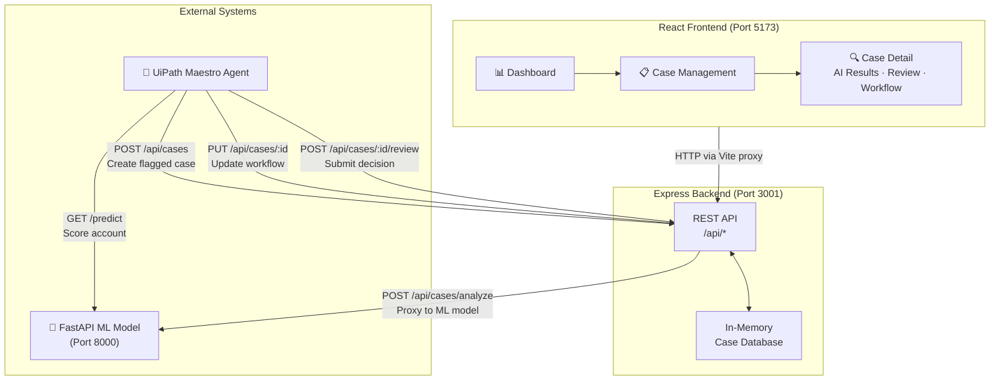
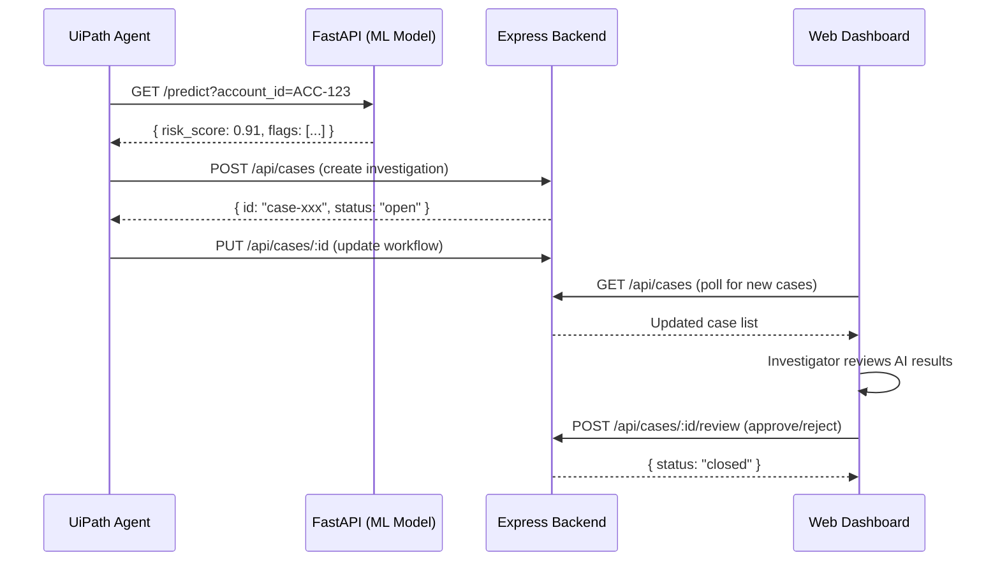
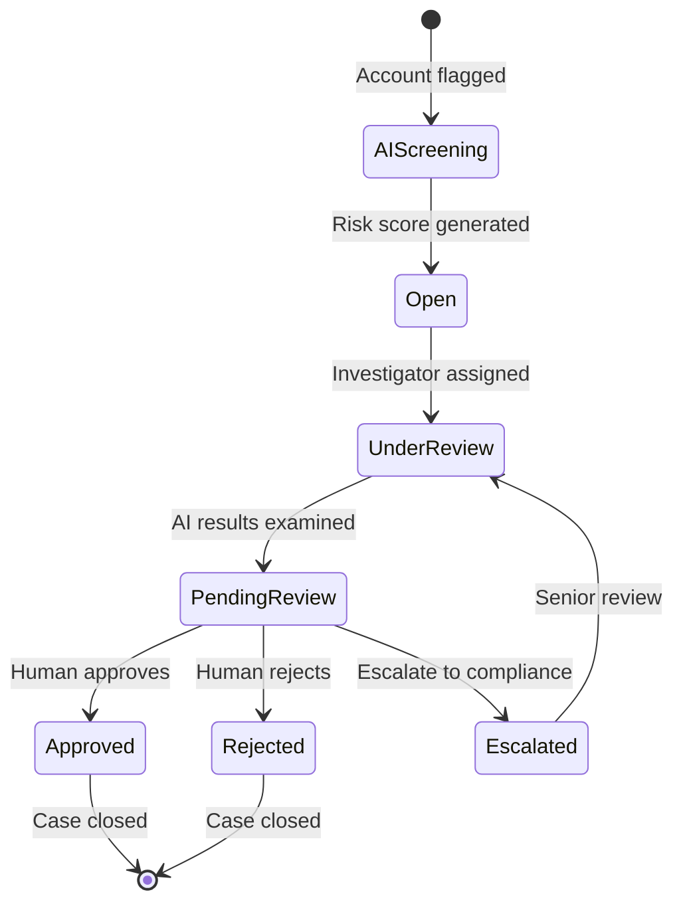
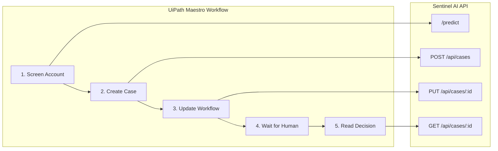

<div align="center">

# 🛡️ Sentinel AI

**AI-Powered Financial Crime Investigation Platform**

An enterprise fraud investigation system where AI screens financial accounts,
UiPath Maestro orchestrates the workflow, and humans make final decisions.

[](https://nodejs.org/)
[](https://react.dev/)
[](https://www.typescriptlang.org/)
[](https://fastapi.tiangolo.com/)
[](https://tailwindcss.com/)

### 🎬 Demo

[](https://youtu.be/V6ib-e0abCs)

▶️ **[Watch the full screen recording on YouTube](https://youtu.be/V6ib-e0abCs)**

</div>

---

## Table of Contents

- [Demo](#-demo)
- [Overview](#overview)
- [Architecture](#architecture)
- [Investigation Workflow](#investigation-workflow)
- [Tech Stack](#tech-stack)
- [Project Structure](#project-structure)
- [Getting Started](#getting-started)
- [API Reference](#api-reference)
- [UiPath Maestro Integration](#uipath-maestro-integration)
- [Screenshots](#screenshots)
- [License](#license)

---

## Overview

Sentinel AI is a fraud investigation platform designed for a **human-in-the-loop AI workflow**. It combines three layers:

1. **AI Screening** — A machine learning model scores accounts for fraud risk (mule accounts, layering schemes, shell companies, etc.)
2. **Orchestration** — UiPath Maestro coordinates the investigation workflow, routing flagged cases to human investigators
3. **Human Review** — Investigators examine AI findings, transaction histories, and fraud indicators to make final Approve / Reject / Escalate decisions

The platform is built as a demonstration of the full end-to-end flow between an AI model, a UiPath RPA agent, and a web-based investigation dashboard.

---

## Architecture



### Data Flow



---

## Investigation Workflow

The platform supports a structured investigation pipeline:



| Stage | Actor | Action |
|-------|-------|--------|
| AI Screening | ML Model | Score account risk (0–100), generate fraud indicators |
| Case Creation | UiPath Agent | Create case in Sentinel with AI results |
| Investigation | Human | Review transactions, network topology, fraud indicators |
| Decision | Human | Approve (close), Reject (close), or Escalate |
| Workflow Update | UiPath Agent | Advance pipeline stages, notify stakeholders |

---

## Tech Stack

### Frontend
| Technology | Purpose |
|---|---|
| React 19 | UI framework |
| TypeScript 6 | Type safety |
| Tailwind CSS 4 | Styling (custom design system — no templates) |
| React Router 7 | Client-side routing |
| TanStack React Query 5 | Server state management + caching |
| Lucide React | Icon set |
| Vite 8 | Dev server + bundler |

### Backend
| Technology | Purpose |
|---|---|
| Node.js + Express 4 | REST API server |
| TypeScript | Type safety |
| In-memory store | Mock database (18 seeded investigation cases) |
| tsx | TypeScript execution + hot-reload |

### AI / ML Layer
| Technology | Purpose |
|---|---|
| Python + FastAPI | ML model serving |
| Deterministic scoring | Hash-based risk scoring (replaceable with GBDT/GNN) |

### Orchestration
| Technology | Purpose |
|---|---|
| UiPath Maestro | Workflow orchestration agent |

---

## Project Structure

```
sentinel-ai/
├── client/                     # React frontend
│   ├── src/
│   │   ├── components/
│   │   │   └── layout/
│   │   │       └── Sidebar.tsx         # Navigation sidebar
│   │   ├── lib/
│   │   │   ├── api.ts                  # API client (all fetch calls)
│   │   │   └── utils.ts               # Utility functions
│   │   ├── pages/
│   │   │   ├── DashboardPage.tsx       # Stats + recent cases
│   │   │   ├── CasesPage.tsx           # Case list with filters
│   │   │   └── CaseDetailPage.tsx      # Full investigation view
│   │   ├── App.tsx                     # Root component + routing
│   │   ├── index.css                   # Complete design system
│   │   └── main.tsx                    # Entry point
│   ├── package.json
│   └── vite.config.ts                  # Vite + proxy config
│
├── server/                     # Express backend
│   ├── src/
│   │   ├── data/
│   │   │   └── mockData.ts            # In-memory database (18 cases)
│   │   ├── routes/
│   │   │   ├── cases.ts               # Case CRUD + analyze endpoint
│   │   │   └── analytics.ts           # Dashboard stats
│   │   └── index.ts                   # Server entry point
│   └── package.json
│
└── .gitignore
```

---

## Getting Started

### Prerequisites

- **Node.js** ≥ 18
- **npm** ≥ 9
- **Python** ≥ 3.10 (for the FastAPI ML model, optional)

### 1. Clone the repository

```bash
git clone https://github.com/TharsanKanthaswamy/Sentinel.git
cd Sentinel
```

### 2. Install dependencies

```bash
# Backend
cd server
npm install

# Frontend
cd ../client
npm install
```

### 3. Start the backend (port 3001)

```bash
cd server
npm run dev
```

### 4. Start the frontend (port 5173)

```bash
cd client
npm run dev
```

### 5. (Optional) Start the FastAPI ML model (port 8000)

```bash
# From the project root or wherever main.py is located
pip install fastapi uvicorn
python main.py
```

### 6. Open the app

Navigate to **http://localhost:5173** in your browser.

---

## API Reference

Base URL: `http://localhost:3001/api`

### Health Check

| Method | Endpoint | Description |
|--------|----------|-------------|
| `GET` | `/health` | Server health + uptime |

### Cases

| Method | Endpoint | Description |
|--------|----------|-------------|
| `GET` | `/cases` | List cases (supports `?search=`, `?status=`, `?riskLevel=`, `?page=`, `?limit=`) |
| `GET` | `/cases/:id` | Full case detail including AI analysis, indicators, transactions, workflow |
| `POST` | `/cases` | Create a new investigation case |
| `PUT` | `/cases/:id` | Update case fields (status, workflow, assignee) |
| `POST` | `/cases/:id/review` | Submit human review decision (approve / reject / escalate) |
| `GET` | `/cases/:id/transactions` | Transaction ledger for a case |
| `GET` | `/cases/:id/network` | Network graph nodes and edges |
| `GET` | `/cases/:id/workflow` | Workflow pipeline stages |
| `POST` | `/cases/analyze` | Trigger AI analysis (proxies to FastAPI `/predict`) |

### Analytics

| Method | Endpoint | Description |
|--------|----------|-------------|
| `GET` | `/analytics/dashboard` | Aggregated stats: total, pending, screened, resolved |

### Example: Create a case

```bash
curl -X POST http://localhost:3001/api/cases \
  -H "Content-Type: application/json" \
  -d '{
    "caseNumber": "SEN-2026-0020",
    "accountId": "ACC-99001",
    "customerName": "Test User",
    "upiId": "test@oksbi",
    "riskScore": 85,
    "riskLevel": "high",
    "status": "open",
    "category": "Mule Account",
    "priority": "high"
  }'
```

### Example: Submit a review

```bash
curl -X POST http://localhost:3001/api/cases/case-001/review \
  -H "Content-Type: application/json" \
  -d '{
    "decision": "approved",
    "notes": "Confirmed fraudulent activity. Account frozen.",
    "reviewer": "Priya Sharma",
    "reviewerId": "usr-001",
    "confidence": 95
  }'
```

---

## UiPath Maestro Integration

The backend API is designed as the integration surface for UiPath Maestro. The agent interacts with Sentinel through standard REST calls.

### Integration Points



| Step | HTTP Call | Purpose |
|------|-----------|---------|
| Screen Account | `GET http://localhost:8000/predict?account_id=ACC-123` | Get risk score from ML model |
| Create Case | `POST /api/cases` with AI results in body | Register flagged account in Sentinel |
| Update Workflow | `PUT /api/cases/:id` with workflow stages | Advance investigation pipeline |
| Poll for Decision | `GET /api/cases/:id` and check `humanReview` field | Wait for investigator to submit decision |
| Read Final Status | `GET /api/cases/:id` → `status` field | `closed` = done, `escalated` = needs senior review |

### Request / Response Contracts

<details>
<summary><strong>POST /api/cases — Create Investigation</strong></summary>

**Request:**
```json
{
  "caseNumber": "SEN-2026-0020",
  "accountId": "ACC-89102",
  "customerName": "Vikram Sen",
  "upiId": "vikram@okicici",
  "phoneNumber": "+91-99887-76655",
  "email": "vikram.sen@gmail.com",
  "riskScore": 85,
  "riskLevel": "high",
  "status": "pending_review",
  "category": "Circular Transfers",
  "priority": "high",
  "aiAnalysis": {
    "riskScore": 85,
    "riskLevel": "high",
    "confidence": 91.5,
    "decision": "Recommend human review",
    "explanation": "High velocity transfers cycling back to source.",
    "featuresUsed": ["Transaction Velocity", "Network Topology"],
    "indicators": [
      {
        "id": "ind-1",
        "type": "velocity",
        "label": "Velocity Spike",
        "severity": "high",
        "confidence": 90,
        "description": "High velocity transactions detected"
      }
    ]
  },
  "transactions": [],
  "workflow": [
    { "id": "wf1", "name": "AI Screening", "status": "completed" },
    { "id": "wf2", "name": "Human Review", "status": "active" }
  ]
}
```

**Response:** `201 Created` — Returns the created case object with a generated `id`.
</details>

<details>
<summary><strong>POST /api/cases/:id/review — Submit Decision</strong></summary>

**Request:**
```json
{
  "decision": "approved",
  "notes": "Confirmed fraudulent. Account frozen.",
  "reviewer": "Priya Sharma",
  "reviewerId": "usr-001",
  "confidence": 95
}
```

**Response:** `200 OK` — Returns `{ message, case }`. Case `status` updates to `closed` (approved/rejected) or `escalated`.
</details>

---

## Screenshots

### Dashboard
> Clean stats overview with recent cases, risk segments, and status badges.

### Case Management
> Filterable case list with search, risk level dropdowns, and status filters.

### Case Detail — Investigation View
> AI screening results with risk ring, fraud indicators, severity badges, transaction history, workflow timeline, and human review actions.

---

## Design Philosophy

- **Neutral dark surfaces** — `#141414` base, `#1c1c1c` cards, `#111111` sidebar. Zero blue tints.
- **Muted indigo accent** — `#6366f1`, used only on active states and case ID links.
- **Risk-encoded color** — Green < 60, Amber 60–79, Red 80+. Nothing else gets color unless it encodes meaning.
- **Dense, intentional layout** — 44px table rows, 12px table text, JetBrains Mono for IDs and scores. Every pixel is considered.
- **No templates** — Custom CSS design system. No shadcn, no Tailwind UI, no component libraries for layout.

---

## License

This project is for educational and demonstration purposes.

---

<div align="center">
  <sub>Built for the UiPath Maestro + AI Agent demonstration workflow</sub>
</div>
